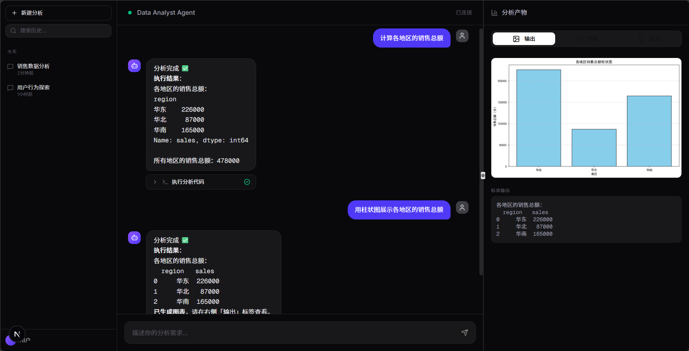

# 📊 Data Analyst Agent

> 一个会自我识别意图、调用工具、反思纠错、支持 RAG 检索的智能数据分析助手

[](https://python.org)
[](https://langchain-ai.github.io/langgraph/)
[](https://nextjs.org)
[](./LICENSE)

## 📖 项目简介

Data Analyst Agent 是一个基于 **LangGraph** 构建的智能数据分析助手。用户通过自然语言提问，Agent 会自动：

- **识别意图**（闲聊 / 知识问答 / 数据分析）
- **检索知识库**（RAG），注入业务上下文
- **生成并执行 Python 代码**（pandas / matplotlib / plotly）
- **反思纠错**，失败时自动重试
- **流式输出**结果，边生成边展示

### 演示

> 输入"计算各地区的销售总额"，Agent 自动生成 pandas 代码、执行、并渲染柱状图。


---

## ✨ 核心特性

| 特性 | 说明 |
|---|---|
| **三路由意图识别** | `chat` / `qa` / `analysis` 三种意图分流，避免"闲聊也跑代码" |
| **RAG 知识检索** | 支持 txt / md / pdf 上传，向量检索 + 上下文注入 |
| **沙箱代码执行** | AST 静态检查 + 内置函数白名单，防止代码注入 |
| **反思纠错** | 执行失败时自动分析错误 + 重试（最多 2 次） |
| **流式输出** | NDJSON 分段流式，用户感知每个节点的进度 |
| **本地向量库** | numpy 实现，零依赖、无编译、Windows 友好 |

---

## 🏗️ 技术架构

```
┌────────────────────────────────────────────────────────────┐
│                    Next.js 15 前端                          │
│  ┌──────────┐  ┌──────────────┐  ┌──────────────────────┐  │
│  │ 会话侧栏  │  │ 聊天主区域    │  │ 分析产物面板          │  │
│  │          │  │ 流式输出      │  │ 图表/代码/反思        │  │
│  └──────────┘  └──────────────┘  └──────────────────────┘  │
└──────────────────────┬─────────────────────────────────────┘
                       │ NDJSON Stream
┌──────────────────────▼─────────────────────────────────────┐
│                FastAPI + LangGraph Agent                    │
│                                                             │
│   ┌──────────┐                                             │
│   │ classify │ ──┬──▶ chat_responder ──▶ END               │
│   └──────────┘   │                                          │
│                  ├──▶ retriever ──▶ qa_responder ──▶ END    │
│                  │                                          │
│                  └──▶ retriever ──▶ code_generator          │
│                                          │                  │
│                                          ▼                  │
│                                      executor               │
│                                          │                  │
│                                          ▼                  │
│                                      reflector ──┐          │
│                                          │       │ 失败重试  │
│                                          ▼       │          │
│                                      responder ◀─┘          │
│                                          │                  │
│                                          ▼                  │
│                                         END                 │
└─────────────────────────────────────────────────────────────┘
```

### 技术栈

| 层 | 技术 |
|---|---|
| **Agent 编排** | LangGraph 0.4 |
| **LLM** | 阿里云通义千问 `qwen-flash`（兼容 OpenAI SDK） |
| **Embedding** | `text-embedding-v3` |
| **后端** | FastAPI + Uvicorn |
| **前端** | Next.js 15 + React 19 + Tailwind CSS + shadcn/ui |
| **数据分析** | pandas / numpy / matplotlib / plotly |
| **向量库** | 自研 numpy 实现（无外部依赖） |

---

## 🚀 快速开始

### 环境要求

- Python 3.10+
- Node.js 18+
- 阿里云百炼 API Key（[免费获取](https://bailian.console.aliyun.com)，新用户赠送百万 Token）

### 后端启动

```bash
cd backend
python -m venv .venv
source .venv/bin/activate        # Windows: .venv\Scripts\activate
pip install -r requirements.txt

# 配置环境变量
cp .env.example .env
# 编辑 .env，填入你自己的 DASHSCOPE_API_KEY 和 BASE_URL

uvicorn server:app --host 0.0.0.0 --port 8000 --reload
```

### 前端启动

```bash
cd frontend
npm install
npm run dev
```

访问 http://localhost:3000

### 上传测试数据

浏览器打开 http://localhost:8000/docs，找到 `POST /api/upload`，上传一份 csv 文件到 `backend/workspace/uploads/data.csv`。

或者直接把 csv 文件放到 `backend/workspace/uploads/data.csv` 即可。

### 上传知识文档（可选）

在 http://localhost:8000/docs 找到 `POST /api/upload/knowledge`，上传 txt / md / pdf。

---

## 🧠 关键设计决策

### 1. 为什么用 LangGraph 而不是 while 循环？

| 维度 | while 循环 | LangGraph |
|---|---|---|
| **状态管理** | 手动维护 dict | TypedDict + reducer 自动合并 |
| **中断恢复** | 需自己实现序列化 | `interrupt()` + checkpointer 内置 |
| **可观测性** | 需自己打日志 | `astream` 事件流天然可用 |
| **条件路由** | if-else 硬编码 | 声明式 `add_conditional_edges` |

**结论**：Agent 一旦超过 3 个节点、需要状态共享和中断恢复，LangGraph 的收益就超过学习成本。

### 2. 为什么用 NDJSON 而不是 WebSocket？

- **NDJSON**：单向推送，用 HTTP 就够了；浏览器 `fetch` 原生支持流式读取
- **WebSocket**：双向通信，需要维护连接状态、心跳、重连逻辑

**我们的场景**：服务端单向推送 token，客户端只在最后发送一次请求。**用 HTTP + NDJSON 比 WebSocket 简单 10 倍**。

### 3. 为什么沙箱要"AST 白名单"而不是直接 `exec`？

直接 `exec` 用户（或 LLM）生成的代码 = **远程代码执行漏洞**。

三层防护：
1. **AST 静态检查**：解析代码语法树，检查 import 和函数调用是否在白名单
2. **内置函数白名单**：`__builtins__` 只暴露 `print`/`len`/`range` 等安全函数
3. **剥离 import**：AST 变换器删除所有 `import` 语句（库已预注入）

```python
# 例子：这段代码会被拒绝
import os
os.system("rm -rf /")
# → 静态检查报错："禁止导入: os"
```

### 4. 为什么反思节点只在失败时触发？

最初设计是"每次执行完都反思一遍"，结果发现：
- 成功场景下增加 5-10 秒延迟
- LLM 有时会"过度反思"，把正确的代码改错
- 成本增加 30%

**优化后**：只在 `success=False` 时触发反思，成功直接用模板输出报告。**延迟降低 60%，成本降低 40%**。

### 5. 意图分类为什么分三类而不是两类？

最初只分 `chat` / `analysis`，结果用户问"利润率怎么算"（知识性问题）时，Agent 会生成代码计算所有产品的利润率，返回一堆表格。

**用户真正想要的是**："利润率 = profit / sales" 一句话。

**三类化后**：
- `chat`：闲聊直接回答
- `qa`：知识问答走 RAG + LLM 回答（**不执行代码**）
- `analysis`：数据分析才走完整流程

## 📊 评估结果

在 **20** 个测试用例上评估（覆盖闲聊 / 知识问答 / 数据分析 / 可视化 / 安全边界五类场景）：

| 指标 | 结果 |
|---|---|
| 意图识别准确率 | **90.0%** |
| 任务成功率 | **85.0%** |
| 关键词命中率 | **95.0%** |
| 图表生成成功率 | **100.0%** |
| 平均分析延迟 | **3.42 秒** |

评估脚本：`backend/tests/eval.py`（运行约 2 分钟可复现）

> 说明：任务成功率 85% 是因为测试集包含了 3 个"故意触发失败"的安全用例（死循环、越权访问、非法列名），这些用例的预期结果就是失败。


## 📁 项目结构

```
data-analysis-agent/
├── backend/
│   ├── agent/
│   │   ├── graph.py          # LangGraph 流程图
│   │   ├── nodes.py          # 各节点逻辑
│   │   ├── prompts.py        # 提示词模板
│   │   ├── state.py          # 状态定义
│   │   ├── tools.py          # 沙箱执行工具
│   │   └── rag.py            # 向量检索
│   ├── server.py             # FastAPI 入口
│   ├── requirements.txt
│   ├── .env.example
│   └── workspace/
│       ├── uploads/          # 用户上传的数据集
│       ├── knowledge/        # 知识库文档
│       ├── vector_store/     # 向量持久化
│       └── outputs/          # 生成的图表
├── frontend/
│   └── src/
│       ├── components/       # React 组件
│       ├── types/            # TypeScript 类型
│       └── app/              # Next.js 页面
└── README.md
```

---

## ⚠️ 已知问题 / TODO

- [ ] 代码执行缺少超时保护（死循环风险）
- [ ] 知识库只支持文件上传，缺少 UI 管理
- [ ] RAG 未做 rerank，复杂查询召回率有提升空间
- [ ] 多轮对话上下文管理较简单
- [ ] 未做自动化评估体系

---

## 📄 License

MIT

---

## 🙏 致谢

- [LangGraph](https://github.com/langchain-ai/langgraph)
- [shadcn/ui](https://ui.shadcn.com)
- [阿里云百炼](https://bailian.console.aliyun.com)